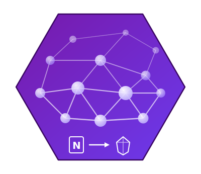

<p align="center">
  
</p>

# Setup Guide

Step-by-step installation for OneNote to Obsidian Sync.

---

## Step 1: Python Environment

You need Python 3.11+. Choose **one** of the following:

### Option A: Conda (recommended)

> Miniconda can be installed without admin rights — select "Just Me" during installation.

1. Download [Miniconda3 Windows 64-bit](https://docs.conda.io/en/latest/miniconda.html)
2. Run the installer:
   - Install for: **Just Me**
   - Location: default (`C:\Users\YourName\miniconda3`)
   - Add to PATH: check the box (optional but convenient)
3. Create and activate:

```bash
conda create -n ds_env python=3.11 -y
conda activate ds_env
```

### Option B: Plain Python (no conda)

If you already have Python 3.11+ installed:

```bash
python --version
# Should output: Python 3.11.x or newer
```

The setup script works without conda — all packages install via pip.

---

## Step 2: Run Setup Script

The setup script installs all packages, configures Tesseract OCR, and builds entity dictionaries:

```bash
# If using conda:
conda activate ds_env

python setup.py
```

What it does:
- Installs pip packages from `requirements.txt`
- If conda is active: also installs pandas/openpyxl/pytesseract via conda
- Finds Tesseract OCR and downloads `eng.traineddata` if missing
- Downloads ontology files (~115 MB) and builds entity dictionaries

It prints a verification summary when done.

**Other options:**

```bash
# Re-download ontologies (updated monthly)
python setup.py --update-entities

# Only refresh entity dictionaries (skip package install)
python setup.py --skip-packages --update-entities

# Set up Tesseract separately (see below)
python setup.py --setup-tesseract
```

---

## Step 3: Configure API Credentials

Required only for `--vision-ai` and `--ai-tags`.

**Corporate proxy setup (Palantir Foundry / LMS):**

```powershell
[Environment]::SetEnvironmentVariable("ANTHROPIC_AUTH_TOKEN", "YOUR TOKEN HERE", "User")
[Environment]::SetEnvironmentVariable("ANTHROPIC_BASE_URL", "https://your-palantir-instance/language-model-service/api/proxy/anthropic", "User")
```

The token is a Palantir JWT. The script sends it as `Authorization: Bearer <token>` (not as `x-api-key`), which is what the Foundry proxy expects.

**Direct Anthropic API:**

```powershell
[Environment]::SetEnvironmentVariable("ANTHROPIC_API_KEY", "sk-ant-...", "User")
```

Restart your terminal after setting variables.

---

## Step 4: OneNote

The script uses COM automation — no browser login or admin rights needed.

1. Open **OneNote desktop app** and sign in
2. Confirm your notebooks are visible and synced
3. Done — if OneNote shows your notebooks, the script can read them

---

## Step 5: First Run

```bash
# If using conda:
conda activate ds_env

python onenote_to_obsidian.py

# With AI features (requires API credentials)
python onenote_to_obsidian.py --vision-ai --ai-tags
```

See the [README](README.md) for all CLI options.

---

## Tesseract OCR (without admin rights)

Tesseract is optional — it enables text extraction from screenshots. Without it, screenshot analysis still runs but can't read text in images.

`setup.py` automatically:
- Detects Tesseract at common install paths (including `Tesseract-OCR` and `tesseract` variants)
- Downloads `eng.traineddata` (~4 MB) if the language data is missing
- Configures PATH and TESSDATA_PREFIX in your User environment

### Option A: Automatic detection

If Tesseract is already installed, `python setup.py` finds and configures it automatically. No extra steps needed.

### Option B: Download and install (no admin rights)

```bash
python setup.py --setup-tesseract
```

This downloads the installer to your temp folder and walks you through the setup.

When the installer opens:
- Select **"Install for current user only"**
- Set install location to: `%LOCALAPPDATA%\Programs\Tesseract-OCR`
  (typically `C:\Users\YourName\AppData\Local\Programs\Tesseract-OCR`)
- Complete the installation

The setup script auto-downloads `eng.traineddata` and configures PATH. Restart your terminal, then:

```bash
tesseract --version
```

### Option C: Manual extraction with 7-Zip (fully portable, no installer)

If you can't run the installer at all:

1. Download the installer `.exe` from [UB-Mannheim releases](https://github.com/UB-Mannheim/tesseract/wiki)
2. Right-click the `.exe` → **7-Zip** → **Extract to folder**
3. Copy the extracted folder to:
   ```
   %LOCALAPPDATA%\Programs\Tesseract-OCR
   ```
4. Tell setup.py where it is:
   ```bash
   python setup.py --tesseract-path "%LOCALAPPDATA%\Programs\Tesseract-OCR"
   ```
   This configures PATH, TESSDATA_PREFIX, and downloads `eng.traineddata` automatically.

### Option D: Point to existing installation

If Tesseract is already installed somewhere:

```bash
python setup.py --tesseract-path "C:\path\to\tesseract"
```

---

## Troubleshooting

### Tesseract not found

```bash
# Re-run Tesseract setup
python setup.py --setup-tesseract

# Or point to an existing installation
python setup.py --tesseract-path "C:\path\to\tesseract"
```

If the PATH was set but the terminal doesn't find it: **restart your terminal** (PATH changes require a new shell session).

### eng.traineddata not found

This is handled automatically now — `setup.py` downloads it from GitHub. If it still fails (e.g. network issues), download manually:

1. Get `eng.traineddata` from https://github.com/tesseract-ocr/tessdata_fast/raw/main/eng.traineddata
2. Place it in your Tesseract `tessdata/` folder (e.g. `C:\...\Tesseract-OCR\tessdata\`)

### API credentials not working

```powershell
# Check current values
[Environment]::GetEnvironmentVariable('ANTHROPIC_AUTH_TOKEN', 'User')
[Environment]::GetEnvironmentVariable('ANTHROPIC_BASE_URL', 'User')
```

If you get a `401 UNAUTHORIZED` error:
- **Corporate proxy**: Ensure `ANTHROPIC_AUTH_TOKEN` is a valid Palantir JWT (starts with `eyJ...`). Tokens expire — regenerate via the Foundry token settings.
- **Direct API**: Ensure `ANTHROPIC_API_KEY` starts with `sk-ant-`.

Restart your terminal after any changes.

### OneNote COM error

- Make sure OneNote desktop app is installed and open
- Sign in and wait for notebooks to fully sync
- Run from a regular terminal (not elevated/admin)

### Package import errors

```bash
# If using conda:
conda activate ds_env

where python
# Should show your environment's python.exe

# Reinstall a specific package
pip install --upgrade <package-name>

# If pip itself is missing:
python -m ensurepip --default-pip
```

### Entity dictionaries missing

```bash
python setup.py --skip-packages
```

### Download truncated (MONDO/HGNC)

If setup fails with a JSON parse error or reports truncation, delete the partial file and retry:

```bash
del entity_data\mondo.json
python setup.py --skip-packages --update-entities
```

---

## Checklist

- [ ] Python 3.11+ available (via conda or standalone)
- [ ] Run `python setup.py` (installs packages, Tesseract, entities)
- [ ] Set API credentials (if using AI features)
- [ ] Restart terminal (for PATH/env var changes)
- [ ] Open OneNote and confirm notebooks are synced
- [ ] Run `python onenote_to_obsidian.py`
